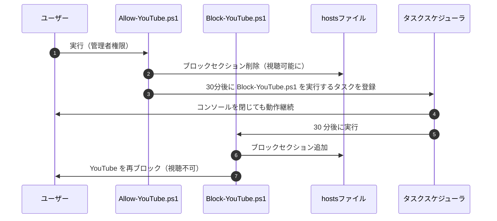

# YouTube 視聴制限ツール

## 機能概要

Windows の hosts ファイルを自動制御し、**普段は YouTube をブロックしつつ、必要なときだけ 30 分間だけ視聴可能にする仕組み**です。

PowerShell スクリプトとタスクスケジューラを組み合わせることで、
**コンソールを閉じても 30 分後に自動で再ブロックされる**ようになっています。

## 主な機能

* ホストファイルを編集して YouTube ドメインをブロック
* 一時解除スクリプト実行で 30 分間だけ視聴可能にする
* 30 分後に自動で再ブロックするタスクをタスクスケジューラへ登録
* タスクは 1 回限りの実行で自動的に消える（※同名タスクは都度削除）
* スクリプトはすべて管理者権限が必須

## ファイル構成

```
YouTubeControl/
├── Block-YouTube.ps1
└── Allow-YouTube.ps1
```

---

## アーキテクチャ概要


