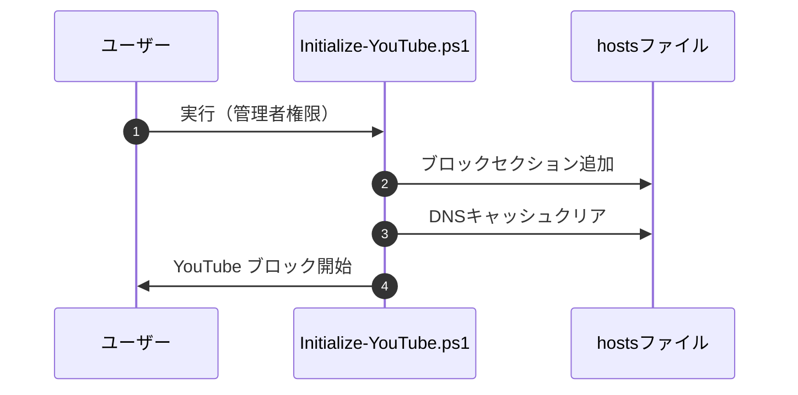
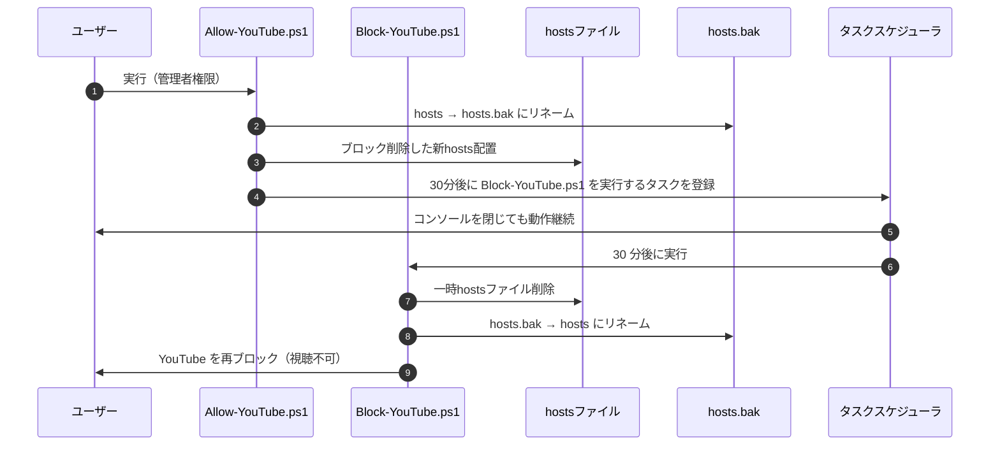

# YouTube 視聴制限ツール

## 機能概要

Windows の hosts ファイルを自動制御し、**普段は YouTube をブロックしつつ、必要なときだけ一時的に視聴可能にする仕組み**です。

PowerShell スクリプトとタスクスケジューラを組み合わせることで、
**コンソールを閉じても指定時間後に自動で再ブロックされる**ようになっています。

## 主な機能

* hostsファイルのバックアップ/リストア方式で確実に制御
* 初期化スクリプトで簡単セットアップ
* 一時解除スクリプト実行で指定時間だけ視聴可能にする（デフォルト30分）
* 自動で再ブロックするタスクをタスクスケジューラへ登録
* タスクは 1 回限りの実行で自動的に消える（※同名タスクは都度削除）
* JSON設定ファイルで簡単カスタマイズ
* スクリプトはすべて管理者権限が必須

## ファイル構成

```
YouTubeControl/
├── Config.json              # 共通設定ファイル
├── Initialize-YouTube.ps1   # 初期化スクリプト
├── Allow-YouTube.ps1        # YouTube解除スクリプト
├── Block-YouTube.ps1        # YouTube再ブロックスクリプト
└── Allow-YouTube.bat        # Allow-YouTube.ps1のショートカット
```

## 使用方法

### 1. 初回セットアップ

管理者権限でPowerShellを開き、以下を実行：

```powershell
.\Initialize-YouTube.ps1
```

hostsファイルにYouTubeブロックセクションが追加されます。

### 2. 一時的に解除（視聴可能にする）

```powershell
.\Allow-YouTube.ps1
```

または `Allow-YouTube.bat` をダブルクリック

- hostsファイルが `hosts.bak` にバックアップされます
- ブロックセクションを削除した新しいhostsファイルが配置されます
- 指定時間後（デフォルト30分）に自動で再ブロックされます

### 3. 手動で再ブロック

```powershell
.\Block-YouTube.ps1
```

- `hosts.bak` が `hosts` に戻されます
- YouTubeが再びブロックされます

## 設定のカスタマイズ

`Config.json` を編集することで設定を変更できます：

```json
{
  "hostsPath": "C:/Windows/System32/drivers/etc/hosts",
  "hostsBackup": "C:/Windows/System32/drivers/etc/hosts.bak",
  "markerStart": "# === YouTube BLOCK START ===",
  "markerEnd": "# === YouTube BLOCK END ===",
  "blockDomains": [
    "youtube.com",
    "www.youtube.com"
  ],
  "allowMinutes": 30
}
```

- `blockDomains`: ブロックするドメインを追加/変更
- `allowMinutes`: 一時解除時間を変更（分単位）

---

## アーキテクチャ概要

### 初期化フロー



### 一時解除フロー



## 技術詳細

### バックアップ/リストア方式

従来の「ファイル内容を直接編集」方式から、「ファイルのバックアップ/リストア」方式に変更しました。

**メリット:**
- シンプルな実装（文字列操作が不要）
- 確実な復元（元のファイルを完全保持）
- 冪等性（重複実行しても安全）
- 状態管理が明確（hosts.bakの有無で判定）

### ログ機能

すべてのスクリプトは `%USERPROFILE%\.logs\YouTubeControl-YYYYMMDD.log` にログを記録します。
