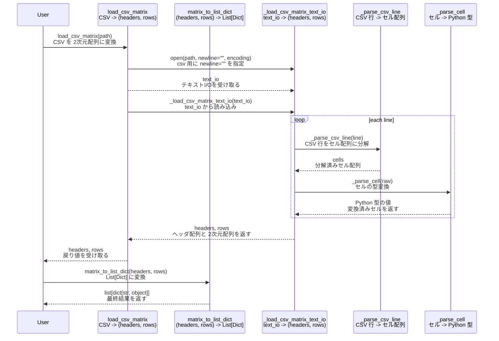

# CSVフォーマット仕様（JSONリテラル）

CSVの各セルは JSON リテラルとして記載します（`json.loads()` で解釈できること）。
例外として、CSV上で空セル（値なし、または `""`）となる場合は `null` とみなします（Pythonでは `None`）。

## ルール

- 文字列は必ずダブルクォートで囲む
- `true / false / null` は小文字のみ
- 禁止例：`'abc'`, `None`, `TRUE`, `FALSE`, `NaN`, `Infinity`

## 記載例

```csv
id,value,flag,comment
1,123,true,null
2,"123",false,"hello,world"
3,,true,"empty-cell-is-null"
4,"",false,"also-null"
```

## メソッド呼び出し関係（CSV → 2次元配列 → List[Dict]）


