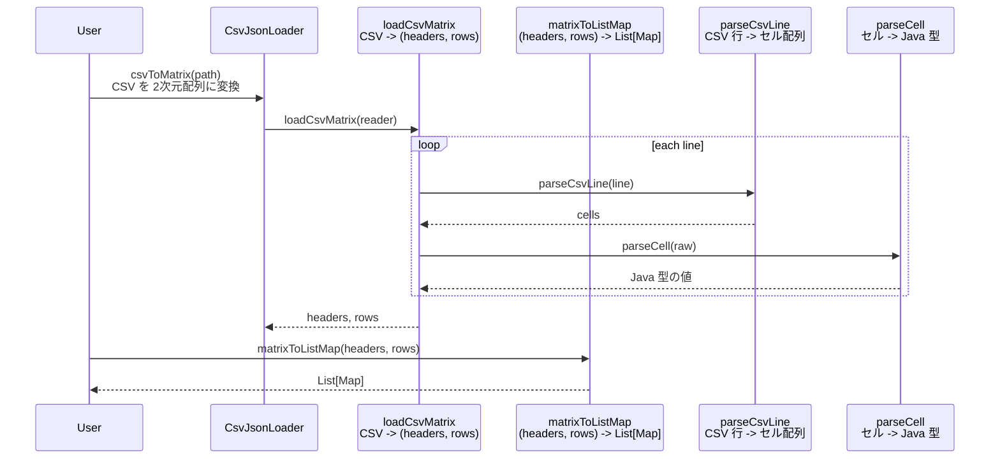

# csv_loader_java

## 概要
CSVの各セルをJSONリテラルとして解釈し、Java型に変換する簡易ローダ。
空セル(値なし)は`null`、`""`は空文字として扱います。

## 使い方

```bash
javac -d . csv_loader_java/src/utils/CsvJsonLoader.java csv_loader_java/examples/ExampleMain.java
java ExampleMain
```

## 入力例

```csv
"id","value","flag","comment"
1,123,true,null
2,"123",false,"hello,world"
3,,true,"empty-cell-is-null"
4,"",false,"empty-string"
```

## 出力例

```
[{id=1, value=123, flag=true, comment=null}, {id=2, value=123, flag=false, comment=hello,world}, {id=3, value=null, flag=true, comment=empty-cell-is-null}, {id=4, value=, flag=false, comment=empty-string}]
```

## メソッド間の関係（CSV → 2次元配列 → List[Map]）


